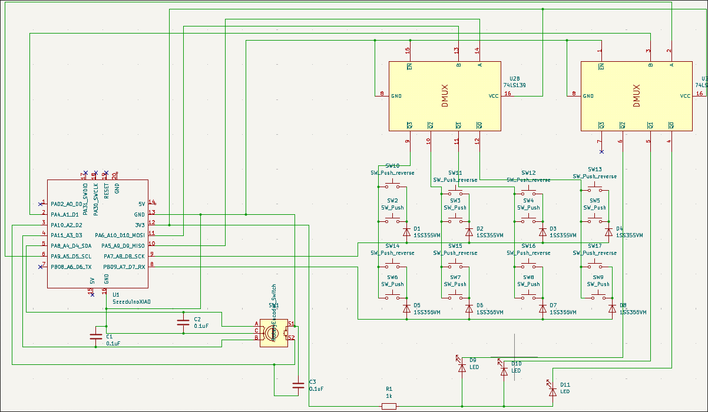
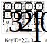
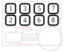

[Japanese docs](./README_ja.md)
# LEFT Parade Project

This is a so-called *left-hand device*.  
It is intended for situations where you use a pen display tablet or similar device with your right hand and want to trigger macros with your left hand.

## TL;DR

## Specifications
- Connectivity is **Bluetooth only**. Wired connections are not supported.  
  This limitation is due to the ESP32-C3; however, by using a board such as the ESP32-S3 that supports USB HID, wired operation can be implemented.
- A battery can be installed (3.7 V Li-ion).  
  Connect it directly to the battery terminals on the surface of the ESP32-C3.
- Up to **80 different macros** can be configured using simultaneous key presses  
  (Arduino IDE is required to configure the macros).
- ~~To enable the above behavior, commands are sent **when the key switch is released**, not when it is pressed.~~  
- 2 mode implimented switched by the push switch in the rotary encoder:
    1. **Combination Mode**
        In this mode, you can assign 80 macros for the combination of multiple keys. The command is send to PC when you release the keys.
    2. **Fast Attack Mode**
        The number of assignment decline to 8 (same as the number of keys), but the command is send when you push the keys. You can use this mode if you mind the delay.

## Circuit Diagram


Pins **D0, D1, D5, and D6** are available as free pins.  
Feel free to use them for LEDs or other custom extensions.

## Bill of Materials
| Component | Price (JPY) |
|:-----------|------------:|
| PCB | 110 |
| Rotary encoder | 550 |
| Knob | 324 |
| ESP32-C3 | 1,080 |
| Keycap | 70 |
| Key socket | 160 |
| Key switch | 330 |
| Battery | 450 |
| (SN74HC139N) | 135 |
| DIP socket (8 × 2 rows) | 135 |
| **Total** | **3,344** |

## Installation  
### Hardware

### Software
1. Install Arduino IDE on your PC, e.g.  
```yay -S arduino-ide```  

2. Install library [Mystfit/ESP32-BLE-CompositeHID](https://github.com/Mystfit/ESP32-BLE-CompositeHID).

3. Upload to `leftandmechv5_PCB/leftandmechv5_PCB.ino` to ESP32-C3.

## Macros
You can set the macro in the preamble of the `.ino` scripts.

```cpp
const uint8_t KC_SAVE[] = { 0x01, KEY_S };
const uint8_t KC_COPY[] = { 0x01, KEY_C };
const uint8_t KC_PASTE[] = { 0x01, KEY_V };
const uint8_t KC_DELETE[] = { 0x4c };
const uint8_t KC_m[] = { KEY_M };
const uint8_t KC_UNDO[] = { 0x01, KEY_Z };
const uint8_t KC_ESC[] = { KEY_ESC };
const uint8_t KC_UP[] = { KEY_UP };
const uint8_t KC_DOWN[] = { KEY_DOWN };
const uint8_t KC_LEFT[] = { KEY_LEFT };
const uint8_t KC_RIGHT[] = { KEY_RIGHT };
const uint8_t KC_PAGE_NEXT[] = { 0x01, KEY_RIGHT };
const uint8_t KC_PAGE_BACK[] = { 0x01, KEY_LEFT };
```
The list of `uint8_t` refers the operation s.t. Ctrl+S, ESC, or Delete. This list of macro is commonly used in the two mode.
In the list, terms of keys except the last term is regarded as modifier keys s.t. Alt, Ctrl or Shift.

### 1. Combination Mode
For this mode, you can set the assignment with `keymap[]`.
```cpp
const keyMapEntry keymap[] = {
  { 1, { KC_SAVE, 2 } },
  { 54, { KC_ESC, 1 } },
  { 4, { KC_COPY, 2 } },
  { 7, { KC_PASTE, 2 } },
  { 2, { KC_DELETE, 1 } },
  { 6, { KC_m, 1 } },
  { 28, { KC_UNDO, 2 } },
  { 18, { KC_UP, 1 } },
  { 9, { KC_DOWN, 1 } },
  { 27, { KC_LEFT, 1 } },
  { 3, { KC_RIGHT, 1 } },
  { 8, { KC_PAGE_NEXT, 2 } },
  { 20, { KC_PAGE_BACK, 2 } }
};
```

The first number refers the keyID of the combinaiton, second string refers the macro which you defined above and the last number refers the number of the element of the list of the macro. You can calculate the keyID as following:



2 refers the upper key, 1 refers the lower key, 0 refers no pushed.
In this mode, it is prohibited to push 2 keys in a column.

### 2. Fast Attack Mode
```cpp
const keyMapEntry direct_key[] = {
  { 1, { KC_LEFT, 1 } },
  { 2, { KC_UP, 1 } },
  { 3, { KC_DOWN, 1 } },
  { 5, { KC_RIGHT, 1 } }
};
```

The key ID which plades the first number corresponds to the following assignment:




## Todo
- [x] Impliment the GAME mode which sends commnad when keys are pushed
- [x] Fabricate a PCB
- [ ] Prepare the other version: RIGHT Parade


## Special Thanks
- [Mystfit/ESP32-BLE-CompositeHID](https://github.com/Mystfit/ESP32-BLE-CompositeHID)
- [freerouting/freerouting](https://github.com/freerouting/freerouting?tab=readme-ov-file)
