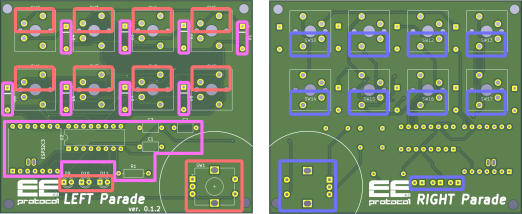

[English docs](./README.md)

_Hat先輩に感謝をこめて,[salt](https://otsu36.net)に期待をこめて..._

# LEFT Parade project

いわゆる左手デバイスです．  
液タブなどを使うときなど片手身別のデバイスを持っているときにもう一方の手でマクロを打ち込みたいときにどうぞ．

## TL;DR


## 仕様
- 接続は**Bluetoothのみ**です．有線接続はサポートしていません．  
ただし，これはESP32C3に依存する制約であるため，ESP32S3などのUSBでのHIDをサポートしているボードを使うことにより，有線接続を実現できるかもしれません．
- バッテリーを搭載可能です（3.7 V, Li-ion）．ESP32C3表面に直接接続してください．  
- 複数キーの同時押しにより，**80通りのマクロ**を設定することができます（マクロの設定にはArduino IDEが必要）. 
-   ~~上記仕様を実現するため、キー押下時ではなく**キーを離したタイミングでコマンドを送信**します．~~\
-   ロータリーエンコーダのプッシュスイッチで切り替え可能な2つのモードを実装しています．
    1.  **Combination Mode**\
        複数キーの組み合わせに対して最大80通りのマクロを割り当て可能です．\
        コマンドはキーを離したタイミングで送信されます．
    2.  **Fast Attack Mode**\
        割り当て可能なマクロは8個（キー数と同数）に制限されますが、キー押下時にコマンドが送信されます．\
        遅延が気になる場合はこちらを使用してください．


## 部品表（Bill of Materials）

|  部品 |  価格（JPY） |
|:-----------|------------:|
| 基板       | 110|
| ロータリーエンコーダー     | 550      |
| ツマミ       | 324        |
| ESP32C3         | 1080          |
| キーキャップ       | 70       |
| キーソケット    | 160     |
| キースイッチ    | 330     |
| バッテリー    | 450     |
| (SN74HC139N)    | 135     |
| DIPソケット（8 × 2 rows）    | 135     |
|**計**    | **3344**     |


## インストール

### ハードウェア

#### 回路図

\
PCB上の部品注記は回路図と対応しています．
**D11のLEDについて，一応設置してみましたが，システムとしては使わない**のではんだ付けの必要はあrません．

#### はんだ付けマップ



左手デバイスとして使用する場合は、**赤および紫の線で囲まれた部品**を実装してください．\
右手デバイスとして使用する場合は、**紫および青の線で囲まれた部品**を実装してください．

部品実装面は、このマップにおける各部品のマーク面側に合わせてください．

### ソフトウェア

1.  Arduino IDE をインストールしてください．
2.  ライブラリ Mystfit/ESP32-BLE-CompositeHID
    をインストールしてください．
3.  `leftandmechv5_PCB/leftandmechv5_PCB.ino` を ESP32-C3
    に書き込んでください．


## マクロ設定

マクロは `.ino` スクリプトの冒頭部分で定義します．

```cpp
const uint8_t KC_SAVE[] = { 0x01, KEY_S };
const uint8_t KC_COPY[] = { 0x01, KEY_C };
const uint8_t KC_PASTE[] = { 0x01, KEY_V };
const uint8_t KC_DELETE[] = { 0x4c };
const uint8_t KC_m[] = { KEY_M };
const uint8_t KC_UNDO[] = { 0x01, KEY_Z };
const uint8_t KC_ESC[] = { KEY_ESC };
const uint8_t KC_UP[] = { KEY_UP };
const uint8_t KC_DOWN[] = { KEY_DOWN };
const uint8_t KC_LEFT[] = { KEY_LEFT };
const uint8_t KC_RIGHT[] = { KEY_RIGHT };
const uint8_t KC_PAGE_NEXT[] = { 0x01, KEY_RIGHT };
const uint8_t KC_PAGE_BACK[] = { 0x01, KEY_LEFT };
```
`uint8_t` の配列は、Ctrl+S、ESC、Delete などのキー操作を表します．このマクロ定義は、両モードで共通して使用されます．
配列内では、最後の要素を除くすべてのキーが修飾キー（Alt、Ctrl、Shift など）として扱われます．

### 1. Combination Mode
このモードでは`keymap[]`似てマクロ割当を行います．
```cpp
const keyMapEntry keymap[] = {
  { 1, { KC_SAVE, 2 } },
  { 54, { KC_ESC, 1 } },
  { 4, { KC_COPY, 2 } },
  { 7, { KC_PASTE, 2 } },
  { 2, { KC_DELETE, 1 } },
  { 6, { KC_m, 1 } },
  { 28, { KC_UNDO, 2 } },
  { 18, { KC_UP, 1 } },
  { 9, { KC_DOWN, 1 } },
  { 27, { KC_LEFT, 1 } },
  { 3, { KC_RIGHT, 1 } },
  { 8, { KC_PAGE_NEXT, 2 } },
  { 20, { KC_PAGE_BACK, 2 } }
};
```

最初の数値はキーの組み合わせに対応する keyID を示します．
2番目は上で定義したマクロを示し、最後の数値はそのマクロ配列の要素数を示します．
keyID は以下の方法で計算できます．


2 は上段キー、1 は下段キー、0 は未押下を示します．
このモードでは、同一列で2つのキーを同時に押すことは禁止されています(反応しません)．

### 2. Fast Attack Mode
```cpp
const keyMapEntry direct_key[] = {
  { 1, { KC_LEFT, 1 } },
  { 2, { KC_UP, 1 } },
  { 3, { KC_DOWN, 1 } },
  { 5, { KC_RIGHT, 1 } }
};
```

最初の数値として指定される key ID は、以下の割り当てに対応しています。


## Todo
- [x] 押下時コマンド送信モードの実装（Gameモードの実装）
- [x] PCBの作成
- [x] 右手バージョンのRIGHT Paradeの開発

## Special Thanks
- [Mystfit/ESP32-BLE-CompositeHID](https://github.com/Mystfit/ESP32-BLE-CompositeHID)

## Contact
もしご質問などあれば[keik4656@gmail.com](keik4656@gmail.com)まで

